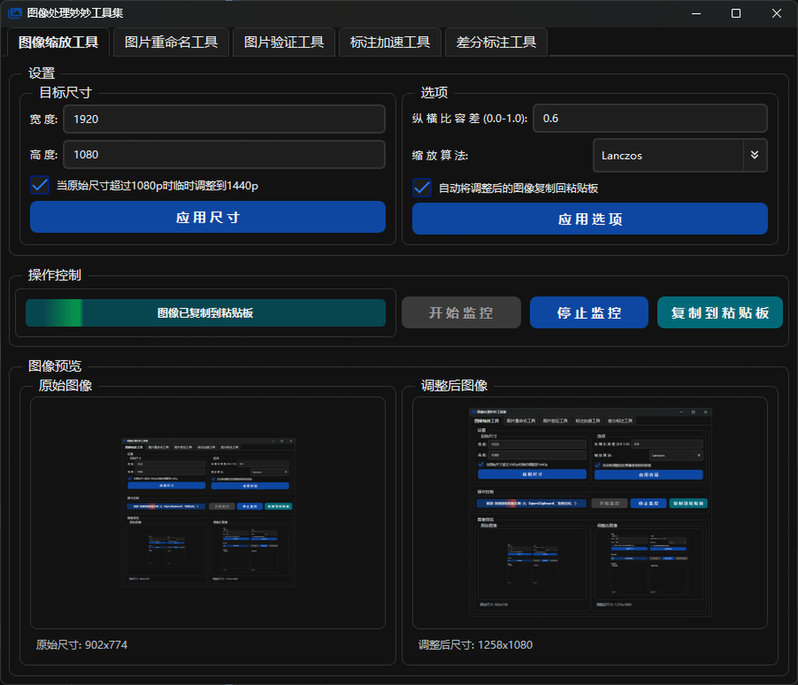
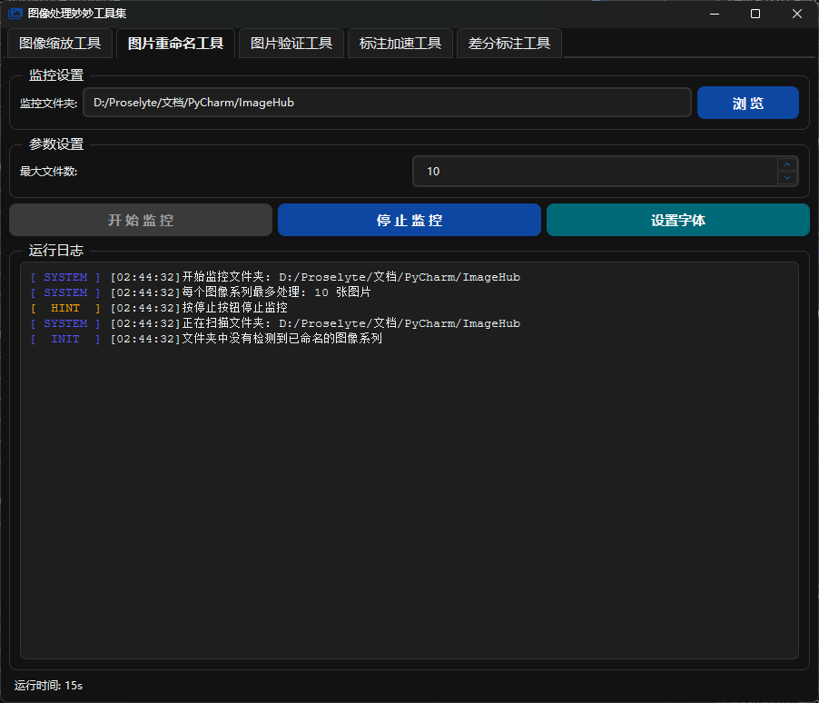
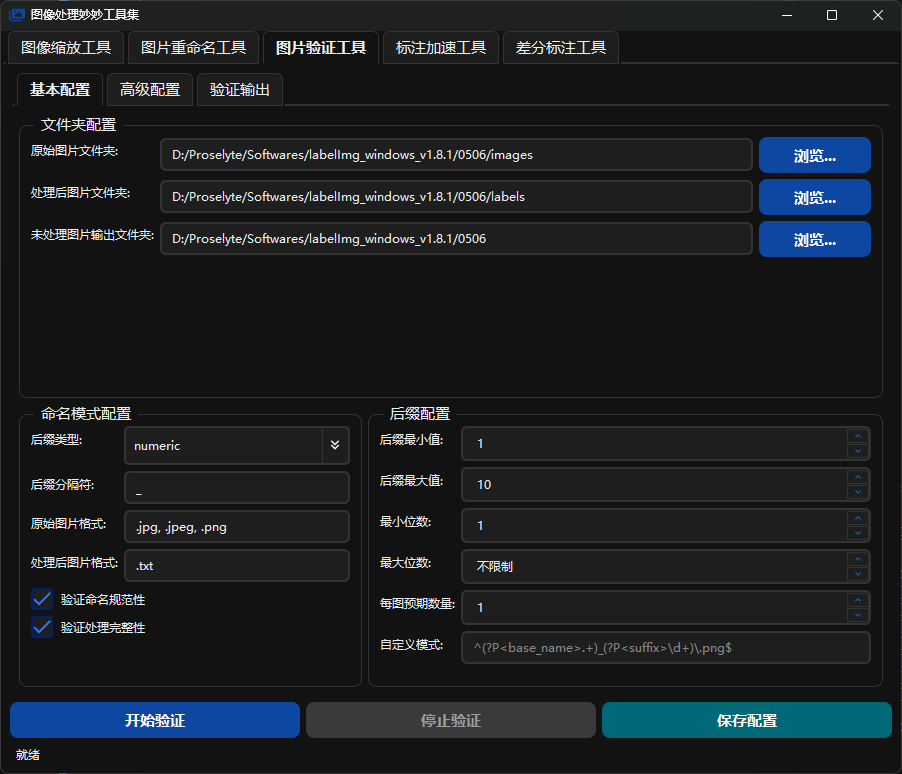
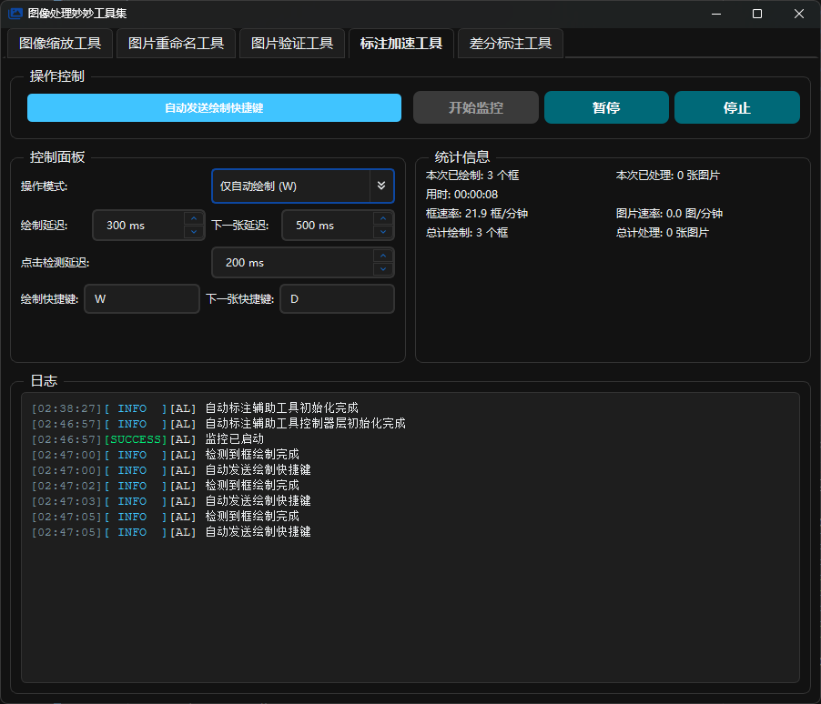
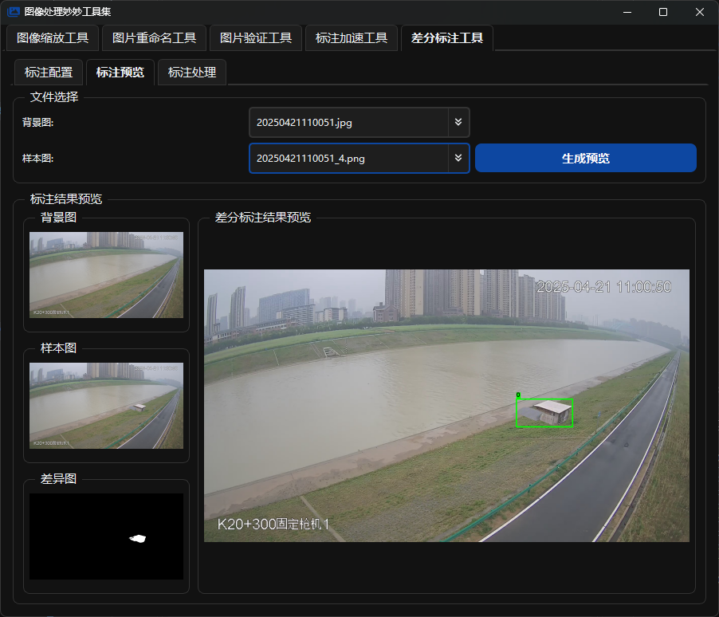
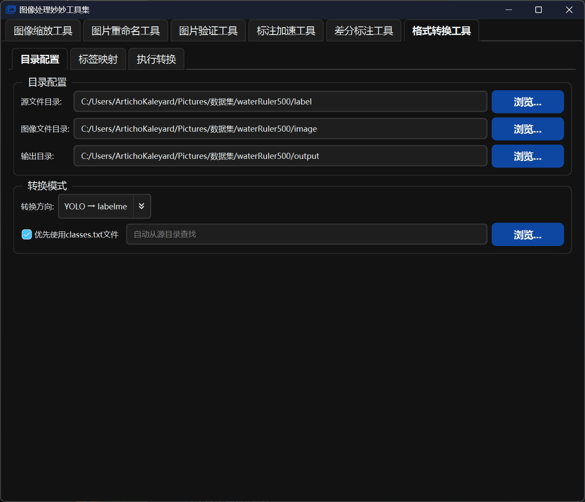

#  ImageHub - 图像处理工具集

ImageHub是一个基于PyQt6开发的多功能图像处理工具集合，提供了丰富的图像处理和标注功能。该工具集包含六个主要功能模块，每个模块都针对特定的图像处理需求进行了优化设计。

## ✨ 功能概览

### 1. 📏 图像缩放工具
- 实时监控系统剪贴板
- 智能调整图像分辨率（支持1080p/1440p自动切换）
- 多种专业缩放算法支持
- 原图与结果实时预览
- 自定义纵横比容差设置
- 一键复制结果到剪贴板

### 2. 🔄 图片自动重命名工具
- 文件夹实时监控
- 自动序号重命名功能
- 自定义文件数量上限
- 实时操作日志显示
- Windows系统通知集成
- 智能防重复处理机制

### 3. ✅ 图像处理验证工具
- 支持批量图像校验
- 多种命名规则验证
- 自动完整性检查
- 多线程并行处理
- 详细的验证报告
- JSON配置文件支持

### 4. 🏷️ 标注加速工具
- **三种标注模式**：
  - 仅自动绘制
  - 仅自动下一张
  - 绘制并自动下一张
- 自定义延迟时间设置
- 实时标注统计
- 完全自定义快捷键
- 实时状态反馈
- 详细的操作日志

### 5. 🔍 差分标注工具
- **两种处理模式**：
  - 标准处理（一对一匹配）
  - 序列处理（一对多匹配）
- 智能差异检测算法
- 可视化标注预览
- YOLO格式输出支持
- 批量处理能力
- 高度可配置参数

### 6. 🔄 格式转换工具
- **双向转换支持**：
  - YOLO → labelme
  - labelme → YOLO
- **智能标签管理**：
  - 自动发现标签
  - 支持 classes.txt 优先级
  - 可视化标签映射配置
- **批量处理能力**：
  - 多线程并行转换
  - 实时进度反馈
  - 详细的转换日志
- **文件格式支持**：
  - 矩形（rectangle）标注
  - 点（point）标注
  - 自动图像尺寸检测
- **配置管理**：
  - 保存/加载配置文件
  - 导入/导出标签映射
  - 自定义参数设置

## ⚙️ 技术特性

- 基于PyQt6的现代化界面设计
- 深色/浅色主题自适应
- 流畅的状态动画效果
- 多线程任务处理
- 实时状态反馈系统
- 自定义字体支持
- 完善的错误处理
- 模块化的项目结构

## 💻 系统要求

### 基本环境
- Python 3.12+
- 操作系统：Windows 10/11

### 核心依赖
- PyQt6 6.9.0+
- PyQt6-WebEngine 6.9.0+
- OpenCV-Python 4.11.0+
- Numpy 2.2.5+
- Pillow (PIL)
- Win32clipboard (Windows平台)
- Watchdog 6.0+
- pynput (可选，用于全局快捷键)

## 📥 安装指南

1. 克隆项目到本地：
```bash
git clone https://github.com/ArtichoKaleyard/ImageHub.git
cd ImageHub
```

2. 创建虚拟环境：

使用venv：
```bash
python -m venv venv
.\venv\Scripts\activate  # Windows
```

或使用Conda：
```bash
conda env create -f environment.yml
conda activate imagehub
```

3. 安装依赖：
```bash
pip install -r requirements.txt
```

## 🚀 使用指南

### 启动应用

主程序启动：
```bash
python main.py
```

独立模块启动：
- 图像缩放工具：`python ClipboardImageScaler/clipboard_image_scaler_gui.py`
- 图片重命名工具：`python AutoRename/auto_rename_gui.py`
- 图像验证工具：`python ImageProcessingValidator/verify_image_gui.py`
- 标注加速工具：`python AutoLabeler/auto_labeler_view.py`
- 差分标注工具：`python DiffLabeler/diff_labeler_view.py`
- 格式转换工具：`python FormatConverter/format_converter_view.py`

### 图像缩放工具使用

1. 设置目标尺寸（默认1920x1080）
2. 配置缩放参数：
   - 纵横比容差值
   - 缩放算法选择
   - 自动复制选项
3. 点击"开始监控"
4. 复制任意图像到剪贴板
5. 自动处理并预览结果



### 图片重命名工具使用

1. 选择监控目录
2. 配置文件数量限制
3. 启动监控功能
4. 向目录中添加图片
5. 自动完成重命名



### 图片处理验证工具使用

#### 基础配置
1. 设置工作目录：
   - 原始图片图目录
   - 处理后图片目录
   - 输出未处理图片目录
2. 配置验证参数：
   - 命名模式配置
   - 后缀配置
   - 性能配置
   - 配置预设

#### 处理流程
1. 配置参数
2. 开始批量验证
3. 查看处理日志和结果



### 标注加速工具使用

1. 选择操作模式
2. 配置操作参数：
   - 绘制延迟时间
   - 切换延迟时间
   - 点击检测延迟
   - 快捷键设置
3. 开始监控
4. 配合标注软件使用



### 差分标注工具使用

#### 基础配置
1. 设置工作目录：
   - 背景图目录
   - 样本图目录
   - 输出目录
2. 配置检测参数：
   - 最小差异面积
   - 检测敏感度
   - 标签ID设置
   - 边界框参数

#### 处理流程
1. 选择处理模式：
   - 标准模式：独立处理每张样本图
   - 序列模式：按序列批量处理
2. 使用预览功能验证效果
3. 开始批量处理
4. 查看处理日志和结果



### 格式转换工具使用

#### 基础配置
1. **目录配置**：
   - 设置源文件目录（YOLO或labelme标注文件）
   - 设置图像文件目录（对应的图片文件）
   - 设置输出目录（转换后的文件）
2. **转换模式选择**：
   - YOLO → labelme：将YOLO格式转换为labelme格式
   - labelme → YOLO：将labelme格式转换为YOLO格式
3. **YOLO classes.txt配置**（YOLO → labelme模式时）：
   - 启用"优先使用classes.txt文件"可从指定文件加载标签
   - 未启用时将自动扫描标注文件发现标签

#### 标签映射配置
1. 点击"自动发现标签"扫描源文件中的所有标签
2. 在映射表中配置标签对应关系：
   - YOLO模式：YOLO类别ID → labelme文本标签
   - labelme模式：labelme文本标签 → YOLO类别ID
3. 支持导入/导出映射配置（JSON格式）

#### 执行转换
1. 完成配置后切换到"执行转换"标签页
2. 点击"开始转换"启动批量处理
3. 实时查看转换进度和详细日志
4. 转换完成后查看成功/失败统计



## 🏗️ 项目结构

```
ImageHub/
├── main.py                     # 主程序入口
├── main_window.py             # 主窗口实现
│
├── ClipboardImageScaler/      # 图像缩放模块
│   ├── clipboard_image_scaler_gui.py
│   └── clipboard_image_scaler_core.py
│
├── AutoRename/                # 图片重命名模块
│   └── auto_rename_gui.py
│
├── ImageProcessingValidator/  # 图像验证模块
│   ├── verify_image_gui.py
│   ├── image_verifier_adapter.py
│   ├── image_verifier_core.py
│   └── help.html
│
├── AutoLabeler/              # 标注加速模块
│   ├── auto_labeler_model.py
│   ├── auto_labeler_view.py
│   └── auto_labeler_controller.py
│
├── DiffLabeler/             # 差异标注模块
│   ├── diff_labeler_model.py
│   ├── diff_labeler_view.py
│   └── diff_labeler_controller.py
│
├── FormatConverter/         # 格式转换模块
│   ├── format_converter_view.py      # 视图层
│   ├── format_converter_model.py      # 模型层
│   ├── format_converter_controller.py # 控制器层
│   └── __init__.py
│
├── style/                   # 样式资源
│   ├── style_config.py
│   ├── style_interface.py
│   └── log_style.py
│
├── utils/                  # 工具类
│   ├── logger.py
│   └── windows_notification.py
│
├── config/                 # 配置文件
│   ├── DI_config.json
│   ├── IPV_config.json
│   └── FC_config.json
│
└── icons/                 # 图标资源
    ├── app_icon.png
    ├── ImageHub.ico
    └── ...
```

## 👨‍💻 开发指南

### 代码风格
- 遵循PEP 8规范
- 遵循MVC架构
- 使用类型注解
- 详细的文档注释
- 模块化设计原则

### 贡献流程
1. Fork 项目
2. 创建特性分支
3. 提交改动
4. 发起合并请求

## 🔜 更新计划

- [ ] 更多图像处理算法
- [ ] 批量处理性能优化
- [ ] 交互体验改进
- [ ] 跨平台兼容性增强
- [ ] 支持更多标注格式转换

## 🙏 致谢

- PyQt6 开发团队
- OpenCV 社区
- 所有代码编写过程中使用的AI工具

## 📜 许可证

本项目采用 MIT 许可证，详情请参阅 LICENSE 文件。

## 📩 联系方式

- 项目地址：[https://github.com/ArtichoKaleyard/ImageHub](https://github.com/ArtichoKaleyard/ImageHub)
- 作者邮箱：[follower193949@outlook.com](mailto:follower193949@outlook.com)

---

如果这个项目对你有帮助，欢迎 star ⭐️ 支持！